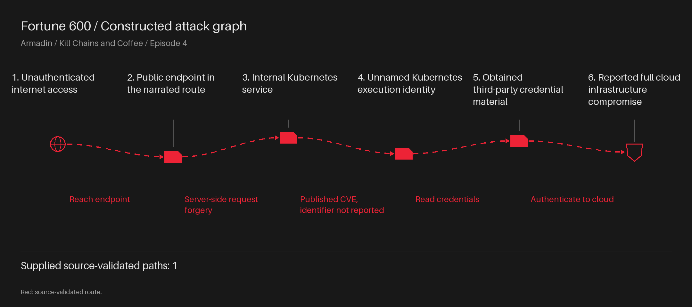
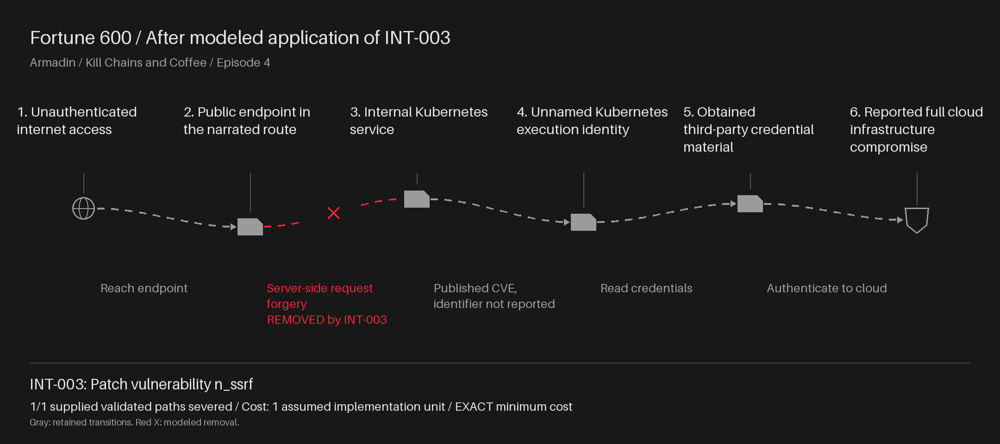
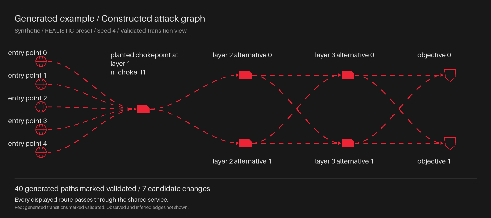
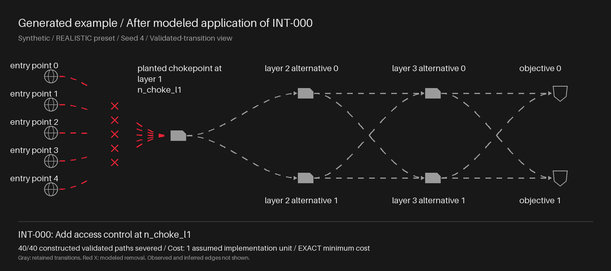
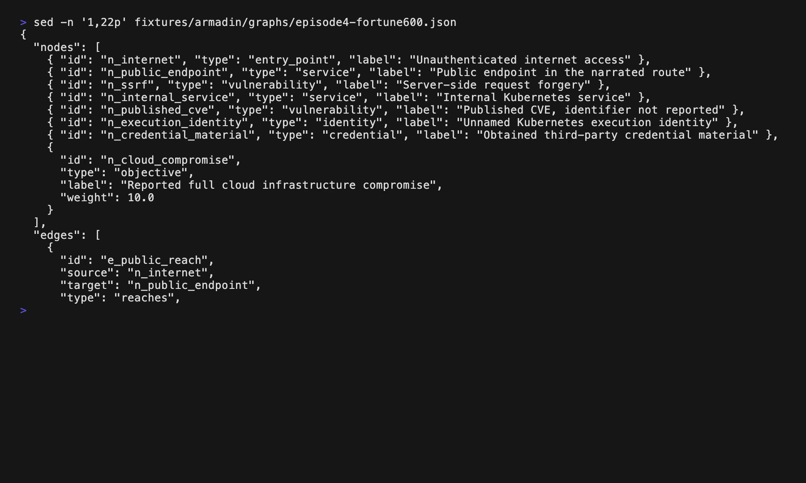

# Lumon

For the Fortune 600 chain reported in Armadin, Kill Chains and Coffee, episode 4, Lumon selects 1 modeled change at minimum cost to sever the 1 supplied source-validated path under the stated cost assumptions; the podcast separately reports 12 remote-code-execution findings.

Constructed REALISTIC graph: 40 paths marked validated, 1 change, cost 1 assumed implementation unit. Lumon proves this is the minimum cost to sever all 40 paths using the 7 modeled candidates.

[Repository](https://github.com/annorak/lumon) · [](https://github.com/annorak/lumon/actions/workflows/ci.yml?query=branch%3Amaster)

## Armadin: episode 4

These two diagrams show the Fortune 600 chain reported in Armadin's
*Kill Chains and Coffee*, episode 4, before and after Lumon's suggested SSRF patch.





## Generated example

This is a generated example, not an Armadin attack. Five entry points feed
40 paths through one shared service. Lumon picks one access-control change
at that service to sever all 40 paths marked validated.





Input: A JSON graph of attacker steps reported as tested.\
Algorithm: Find the cheapest modeled changes that sever the supplied validated paths.\
Output: Selected changes, path coverage, and unvalidated bypass hypotheses to test.

## Run the demo

You need Git, Python 3.12, and [uv](https://docs.astral.sh/uv/getting-started/installation/).
If Python 3.12 is missing, run `uv python install 3.12`.

```sh
git clone https://github.com/annorak/lumon.git
cd lumon
uv run --frozen python demo/run_demo.py
```

The command runs both cases, prints their selected changes, and saves
[demo/output/result.json](demo/output/result.json). The constructed case uses the
unchanged REALISTIC preset with seed 4. Its paths are generated, not real attacks.

Dependencies may need internet to download. Once installed, the demo runs locally
without API keys, Docker, or external services.

## Watch the demo



[Play the 90-second video](docs/demo.mp4).

The GIF and silent video show the Armadin case from *Kill Chains and Coffee*,
episode 4: its input graph, selected change, and saved result.
Run the command above for both cases.

## Why Lumon?

I named it after Lumon Industries in
[Severance](https://en.wikipedia.org/wiki/Severance_(TV_series)).
In the show, employees separate their work and personal memories.
Here, we're looking for changes that sever validated attack paths.

See the [demo guide](docs/demo-guide.md) for the evidence, model details,
development commands, and instructions for updating the media.
