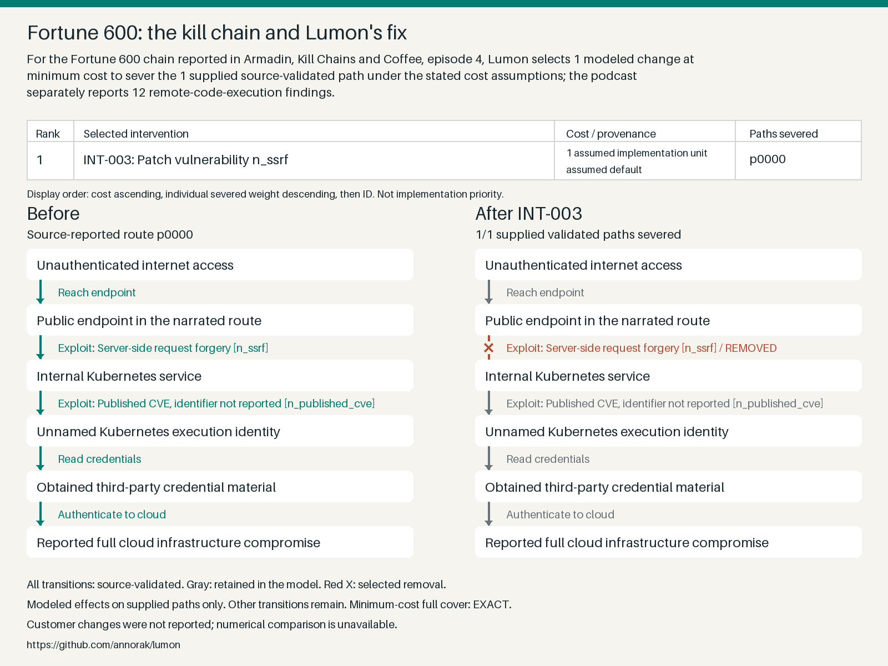

# Lumon

For the Fortune 600 chain reported in Armadin, Kill Chains and Coffee, episode 4, Lumon selects 1 modeled change at minimum cost to sever the 1 supplied source-validated path under the stated cost assumptions; the podcast separately reports 12 remote-code-execution findings.

[Repository](https://github.com/annorak/lumon) · [](https://github.com/annorak/lumon/actions/workflows/ci.yml?query=branch%3Amaster)



Input: A JSON graph of attacker steps reported as tested.\
Algorithm: Find the cheapest modeled changes that sever the supplied validated paths.\
Output: Selected changes, path coverage, and unvalidated bypass hypotheses to test.

## Run the demo

You need Git, Python 3.12, and [uv](https://docs.astral.sh/uv/getting-started/installation/).
If Python 3.12 is missing, run `uv python install 3.12`.

```sh
git clone https://github.com/annorak/lumon.git
cd lumon
uv run --frozen python demo/run_demo.py
```

The command computes the result, prints the selected change, and saves
[demo/output/result.json](demo/output/result.json).

Dependencies may need internet to download. Once installed, the demo runs locally
without API keys, Docker, or external services.

## Watch the demo


[Play the 90-second video](docs/demo.mp4).

The silent recording shows the input graph, runs the demo, and displays the
selected change and saved result. It includes pauses for reading.

## Why Lumon?

I named it after Lumon Industries in
[Severance](https://en.wikipedia.org/wiki/Severance_(TV_series)).
In the show, employees separate their work and personal memories.
Here, we're looking for changes that sever validated attack paths.

See the [demo guide](docs/demo-guide.md) for the evidence, model details,
development commands, and instructions for updating the media.
